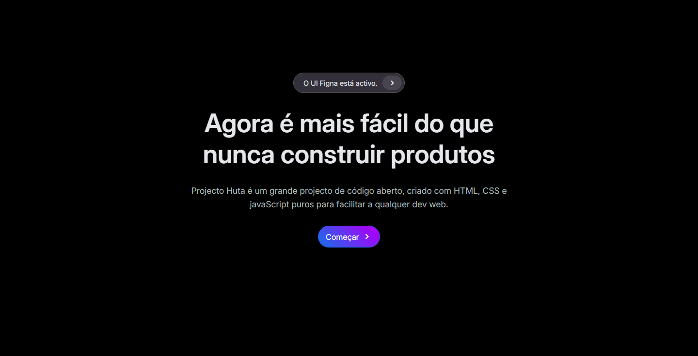

# Hero form Atum
 

<a href="https://hutadev.github.io/hero_section_atum/"> 

<picture>
     <source media="(prefers-color-scheme: dark)" srcset="src/imagens/preview.webp">
     <source media="(prefers-color-scheme: light)" srcset="src/imagens/preview.webp">
     
</picture>

</a>

> É uma secção de formulário de contacto/inscrição ou login,

### Ajustes e melhorias

O projeto está finalizado. mas se houver próximas actualizações serão adicionadas na v1.2

## 💻 Pré-requisitos

Antes de começar, verifique se você atendeu aos seguintes requisitos:

- Tenha conhecimento médio de HTML e CSS
- Ter domínio de variaveis em CSS

## 🚀 Obter códigos

Você pode fazer o `Fork` deste projecto ou mesmo copiar o código com `Ctrl` + `C` e adicionar no seu projecto

## 📫 Contribuindo

Para contribuir com no projecto, siga estas etapas:

1. Bifurque este repositório.
2. Crie um branch: `git checkout -b <nome_branch>`.
3. Faça suas alterações e confirme-as: `git commit -m '<mensagem_commit>'`
4. Envie para o branch original: `git push origin <nome_do_projeto> / <local>`
5. Crie a solicitação de pull.

> Pode ser directamente do Git ou GitHub

## 🤝 Colaborador

Agradecemos às seguintes pessoas que contribuíram para este projeto:

<table>
<tr>
<td align="center">
     <a href="#" title="Hélio Carlitos">
      
     
          <b>Hélio Carlitos</b>
     
     </a>
</td>
<!-- <td align="center">
     <a href="#" title="defina o título do link">
      
     
          <b>Mark Zuckerberg</b>
     
     </a>
</td>
<td align="center">
     <a href="#" title="defina o título do link">
      
     
          <b>Steve Jobs</b>
     
     </a>
</td> -->
</tr>
</table>

Esse projecto está sob licença. Veja o arquivo [LICENÇA](https://github.com/HutaDev/hero_section_atum?tab=MIT-1-ov-file) para mais detalhes.
